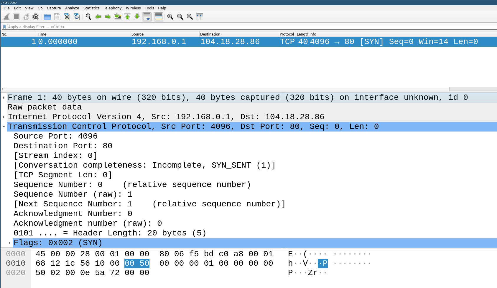

# libpcapng

C library with Python bindings to read and write pcapng buffers. It follows the pcapng standard from https://github.com/pcapng/pcapng

## Writing your first packet

Let's write a TCP SYN using libdumbnet and push the buffer into a pcapng file:

```c
#include <stdio.h>
#include <stdlib.h>
#include <string.h>

#include <dumbnet.h>
#include <libpcapng/libpcapng.h>

int main(int argc, char **argv)
{
	FILE *pcapout;

	char *pkt;
	size_t pktsize = 40;

	pkt = (char *)malloc(pktsize);
	if (!pkt) {
	   fprintf(stderr, "Cannot allocate pkt!\n");
	   return -1;
	}

	pcapout = fopen("pkts.pcap", "wb");

	libpcapng_write_header_to_file(pcapout);

	uint32_t saddr = 0x0100a8c0;
	uint32_t daddr = 0x561c1268;

	ip_pack_hdr(pkt, 0, pktsize, 1, 0, 128, IP_PROTO_TCP, saddr, daddr);
	tcp_pack_hdr(pkt + 20, 4096, 80, 1, 0, TH_SYN, 14, 0);
	ip_checksum(pkt, pktsize);

	libpcapng_write_enhanced_packet_to_file(pcapout, pkt, pktsize);

	fflush(pcapout);
	fclose(pcapout);

	free(pkt);

	return 0;
}
```

Compile using:
```
gcc test.c -o test -ldumbnet $(pkg-config libpcapng --libs --cflags)
```

And after running, open the created pcap with wireshark:

<p align="center"></p>
